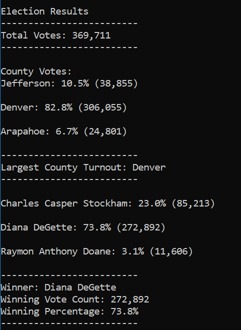
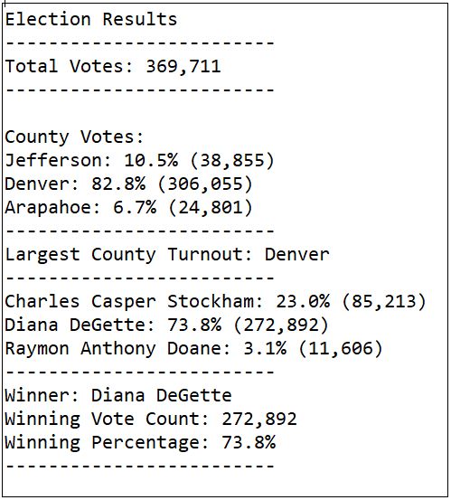

# Election Analysis

## Project Overview
I was tasked to help Tom, a Colorado Board of Elections employee, in an election audit of the tabulated results for a ***US Congressional precinct in Colorado***. 

I had to use Python to extract and analyze data from the election results CSV file. 

## Purpose

In the past, I helped Tom to determine the winner of the election and output the results to an external file and the terminal.

Now, the election commission requested some additional data to complete the audit:
* The voter turnout for each county
* The percentage of votes from each county out of the total count
* The county with the highest turnout

## Analysis Steps
In the last analyis (see the code file `PyPoll.py`), we developed a code to print the total number of votes cast, the candidates who ran, their total vote count, the percentage on vote share, and the stats of the winning candidate on the terminal as well as an external .txt file.

For this analysis, we had to take the process further to calculate and print the data for different counties.

Below are the steps that were undertaken

1. Initialized a county list `county_options = []` to hold the names of the counties. Initialized a dictionary `county_votes = {}` to hold the county as the key and the votes cast for each county as the values.
2. Initialized an empty string `winning_county = ""` to hold the county name for the county with the largest turnout. Initialized a variable `winning_county_count = 0` to hold the number of votes of the county that had the largest turnout. Initialized a variable `winning_county_percentage = 0` to hold the perentage of the county with the highest turnout.
3. While reading the election results from each row inside the for loop, wrote a script `county_name = row[1]` that gets the county name from each row.

4.
    (4a) Wrote a decision statement with a logical operator `if county_name not in county_options:` to check if the county name acquired in Step 3 is in the county list created in Step 1.

    (4b) If the county is not in the list created in Step 1, added it to the list of county names `county_options.append(county_name)`

    (4c) Wrote a script that initialized the county vote to zero, to track the vote counts for the county. `county_votes[county_name] = 0`
    
5. Wrote a script that added a vote to the county’s vote count as we were looping through all the rows, like we did for the candidate’s vote count. `county_votes[county_name] += 1`

6.
    (6a) Wrote a repetition statement to get the county from the county dictionary that was created in Step 1. `for county_name in county_votes:`
    
    (6b) Initialized a variable to hold the county’s votes as they are retrieved from the county votes dictionary. `county_total_votes = county_votes.get(county_name)`
    
    (6c) Wrote a script that calculates the county’s votes as a percentage of the total votes. `county_vote_percentage = float(county_total_votes) / float(total_votes) * 100`

    (6d) Wrote a print statement that prints the current county, its percentage of the total votes, and its total votes to the command line.
    
        county_results = (
            f"{county_name}: {county_vote_percentage:.1f}% ({county_total_votes:,})\n")
        print(county_results)
    
    (6e) Wrote a script that saves each county, the county’s total votes, and the county’s percentage of total votes to the election_results.txt file. `txt_file.write(county_results)`

    (6f) Wrote a decision statement that determines the county with the largest vote count and then adds that county and its vote count to the variables created in Step 2.
    
        if (county_total_votes > winning_county_count) and (county_vote_percentage > winning_county_percentage):
            winning_county_count = county_total_votes
            winning_county = county_name
            winning_county_percentage = county_vote_percentage 
        
         
7. Wrote a print statement that prints out the county with the largest turnout.

    ```
    winning_county_summary = (
        f"-------------------------\n"
        f"Largest County Turnout: {winning_county}\n"
        f"-------------------------\n")
    print(winning_county_summary)  
    ```
8. Wrote a script that saves the county with the largest turnout to the election_results.txt file.
`txt_file.write(winning_county_summary)`

## Election-Audit Results

Image 1 (below): Output on the Terminal/Command line



Image 2 (below): Output on the Txt file



* How many votes were cast in this congressional election?

```
A total of 369,711 votes were cast in the congressional elections
```

* Provide a breakdown of the number of votes and the percentage of total votes for each county in the precinct.

```
County 1: Jefferson: 10.5% (38,855)
County 2: Denver: 82.8% (306,055)
County 3: Arapahoe: 6.7% (24,801)
```

* Which county had the largest number of votes?

```
The county that had the largest number of votes was Denver (306,055 votes).
```
* Provide a breakdown of the number of votes and the percentage of the total votes each candidate received.
```
Candidate 1. Charles Casper Stockham: 23.0% (85,213)
Candidate 2. Diana DeGette: 73.8% (272,892)
Candidate 3. Raymon Anthony Doane: 3.1% (11,606)
```

* Which candidate won the election, what was their vote count, and what was their percentage of the total votes?
```
Winner of the election: Diana DeGette
Total Votes Cast for Diana: 272,892
Percentage of total votes cast for Diana: 73.8%
```

## Election-Audit Summary 
This script is quite robust and can be used for any election where we have a dataset in a similar format.
Having said that, if we have some more data, we can easily modify the script to provide more insights.
1.	If the total number of voters in each of these counties is provided, we can modify the script to return the voter turnout in each county.
2.	If the demographic data of the voters is provided in each row, we can modify the script to see

    (a) What was the popularity of different candidates among each group?

    (b) What was the demographic breakdown of each candidate?

    (c) We can also add the dimension of a county, say how many people from a group X from a county Y voted for a candidate Z.
3.	If the voting time of the voters is captured in each row, we can modify the script to see the co-relation of time & day to the voting pattern of people. Over time, the effects of seasons, holidays, etc in the voter turnout can also be analyzed. The commission can use this analysis to choose dates/days with probability of higher voter turnout.
